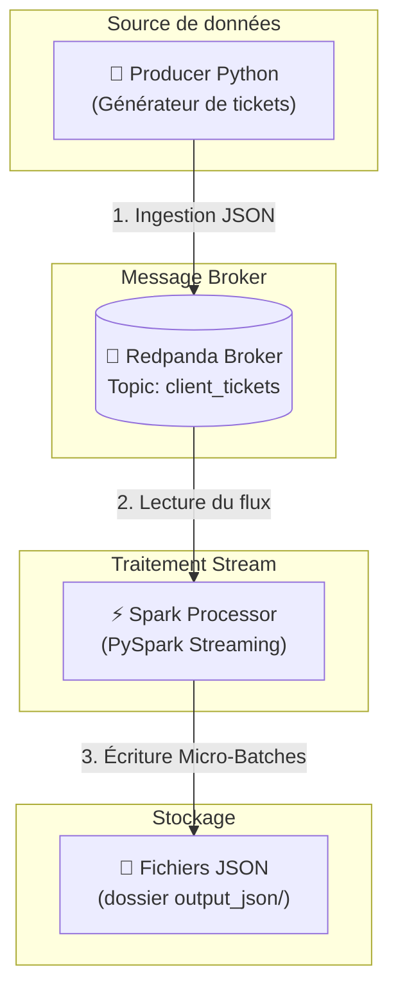

## 📊 Schéma du Flux de Données (Mermaid)

```mermaid
flowchart TB
    subgraph S1[Source de données]
        A["🐍 Producer Python<br/>(Générateur de tickets)"]
    end

    subgraph S2[Message Broker]
        B[("🐼 Redpanda Broker<br/>Topic: client_tickets")]
    end

    subgraph S3[Traitement Stream]
        C["⚡ Spark Processor<br/>(PySpark Streaming)"]
    end

    subgraph S4[Stockage]
        D["📁 Fichiers JSON<br/>(dossier output_json/)"]
    end

    A -->|1. Ingestion JSON| B
    B -->|2. Lecture du flux| C
    C -->|3. Écriture Micro-Batches| D

```