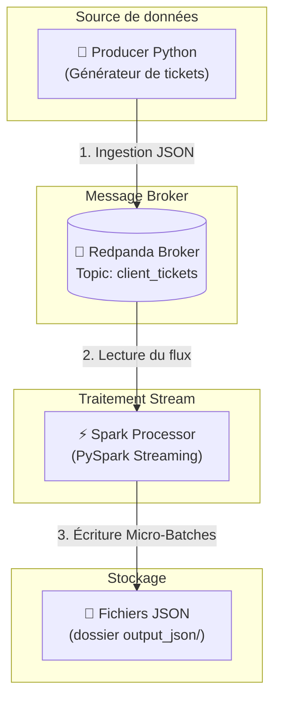

# 🚀 Pipeline ETL Streaming avec Redpanda & PySpark (POC)

Ce projet est une preuve de concept (POC) mettant en œuvre une architecture de traitement de données en temps réel (Streaming ETL). 

Il simule l'émission continue de tickets clients, les achemine à travers un message broker haute performance (Redpanda), puis les consomme via PySpark Structured Streaming pour les traiter et les exporter au format JSON.

---

## 📊 Schéma du Flux de Données (Mermaid)

    
    
    
Détail des composants :
Producer (producer.py) : Génère en boucle des données de tickets de support client au format JSON.

Broker (Redpanda) : Alternative rapide à Kafka, stocke les événements dans le topic client_tickets.

Consumer (spark_processor.py) : Traite le flux continu avec PySpark Structured Streaming.

Storage (output_json/) : Reçoit les résultats filtrés et structurés sous forme de fichiers JSON.

📽️ Vidéo de Démonstration
Une courte présentation vidéo illustrant le fonctionnement du pipeline, le démarrage des conteneurs et la génération des fichiers de sortie est disponible ici :

## 🎥 Vidéo de Démonstration

Une courte présentation vidéo illustrant le fonctionnement du pipeline, le démarrage des conteneurs et la génération des fichiers de sortie :

👉 **[Regarder la vidéo de démonstration du POC](https://github.com/K93000/P9-Modelisez-une-infrastructure-dans-le-cloud/raw/main/Documents/2026-08-17%2013-29-21.mp4)**

🛠️ Prérequis
Docker Desktop (avec Docker Compose V2)

Python 3.x (pour le développement local éventuel)

🚀 Démarrage Rapide
1. Lancer l'infrastructure
À la racine du projet, lancez l'ensemble des conteneurs orchestrés :

Bash
docker compose up --build
2. Vérifier les conteneurs
Les 3 services démarreront en synergie :

redpanda : Le broker de messages.

producer_tickets : Le générateur de flux.

spark_processor : Le moteur de traitement PySpark (redémarre automatiquement si le topic est en cours de création).

3. Consulter les résultats
Les fichiers JSON générés par Spark apparaissent en direct dans le dossier local :

Bash
./output_json/
4. Arrêter le pipeline
Pour tout couper proprement :

Bash
docker compose down
📁 Structure du Projet
Plaintext
├── docker-compose.yml       # Orchestration des conteneurs Docker
├── Dockerfile.producer      # Image Docker pour le Producer Python
├── Dockerfile.spark         # Image Docker pour PySpark Streaming
├── producer.py              # Script de génération de tickets
├── spark_processor.py       # Script ETL PySpark
├── output_json/             # Dossier de sortie monté (résultats JSON)
├── .gitignore               # Exclusions Git
└── README.md                # Documentation du projet

Obs - complet
Screencastify
Loom
